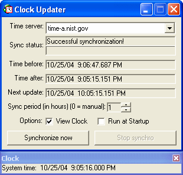



## Clock Updater

### Description

This is another way of synchronizing with an atomic time server without MSWINSCK.OCX **nor** MSINET.OCX **nor** an "embedded" web browser. It uses the following API's to retrieve the time from the Internet: InternetOpen, InternetOpenUrl, InternetReadFile, and InternetCloseHandle. All four of these API's come from wininet.dll in the system/system32 folder. It even minimizes to the system tray, and you can also view the system time as well. Also, you can choose from a list of time servers in the drop-down menu. In addition, you can schedule time synchronization. Plus, you can choose to have it start up with Windows. Plz vote if you like this!!! :-)
 
### More Info
 

             |
---                |---
**Submitted On**   |2004-10-25 20:10:20
**By**             |[mathXpert](https://github.com/Planet-Source-Code/PSCIndex/blob/master/ByAuthor/mathxpert.md)
**Level**          |Intermediate
**User Rating**    |4.8 (38 globes from 8 users)
**Compatibility**  |VB 6\.0
**Category**       |[Internet/ HTML](https://github.com/Planet-Source-Code/PSCIndex/blob/master/ByCategory/internet-html__1-34.md)
**World**          |[Visual Basic](https://github.com/Planet-Source-Code/PSCIndex/blob/master/ByWorld/visual-basic.md)
**Archive File**   |[Clock\_Upda18101710252004\.zip](https://github.com/Planet-Source-Code/mathxpert-clock-updater__1-56927/archive/master.zip)

